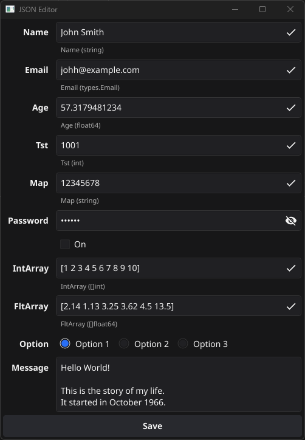

# Config helper go package

This package is a helper for processing json configurations files.
It can unmarshal json to a go struct or to the universal `map[string]any` and prepare it data to show in the terminal or gui form.

[](https://godoc.org/github.com/teonet-go/conf/)
[](https://goreportcard.com/report/github.com/teonet-go/conf)

## How to use

The is an example of usage which read config file and show it in the fine-io gui form: [cmd/conf/main.go](cmd/conf/main.go)

The conf package helps unmarshal json to go struct and prepare it data to show in the gui form. This autmatically created form has names of fields and entries to edit values and validator which check fields type.

Current package version can automatically process simple string and number types and special Email, Password, Multiline and RadioGroup types from input json.

Config package can also unmarshal json to the `map[string]any` without nesessary to create a struct with fields type.



## How to install

The package can be installed using:

```shell
go get github.com/teonet-go/conf
```

The packages example can be installed with:

```shell
go install github.com/teonet-go/conf/cmd/conf@latest
```

## License

[BSD](LICENSE)
